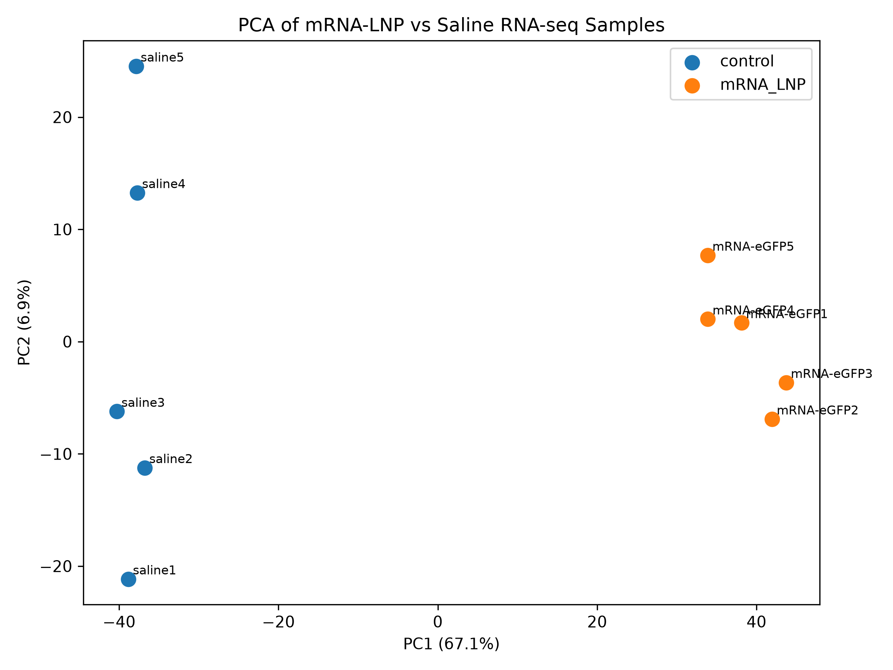
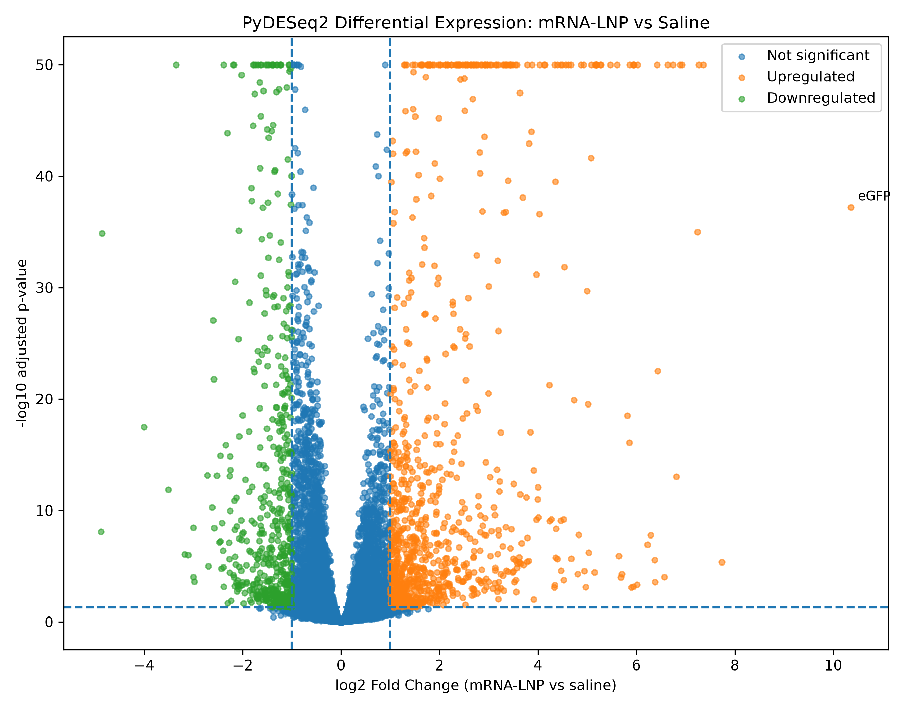
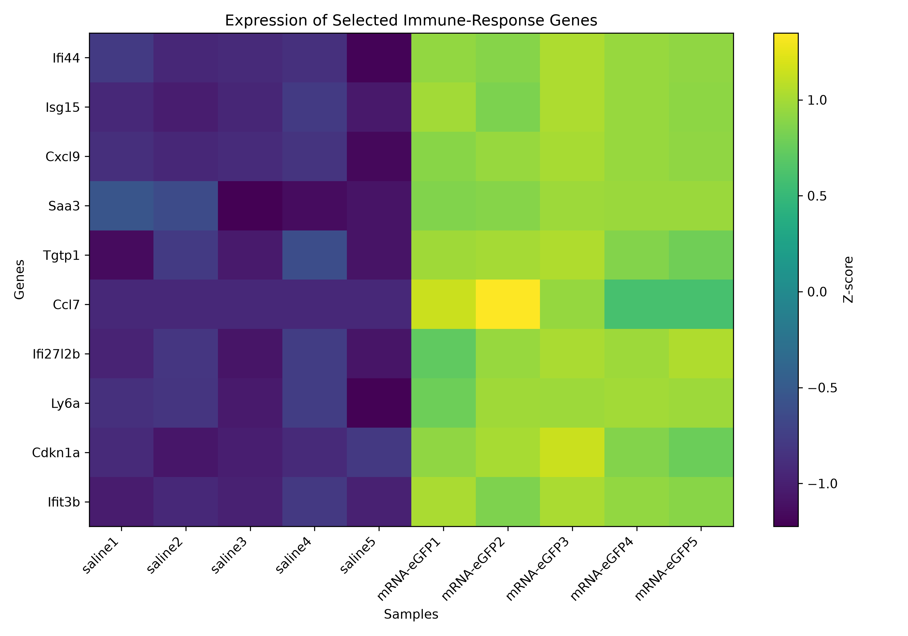
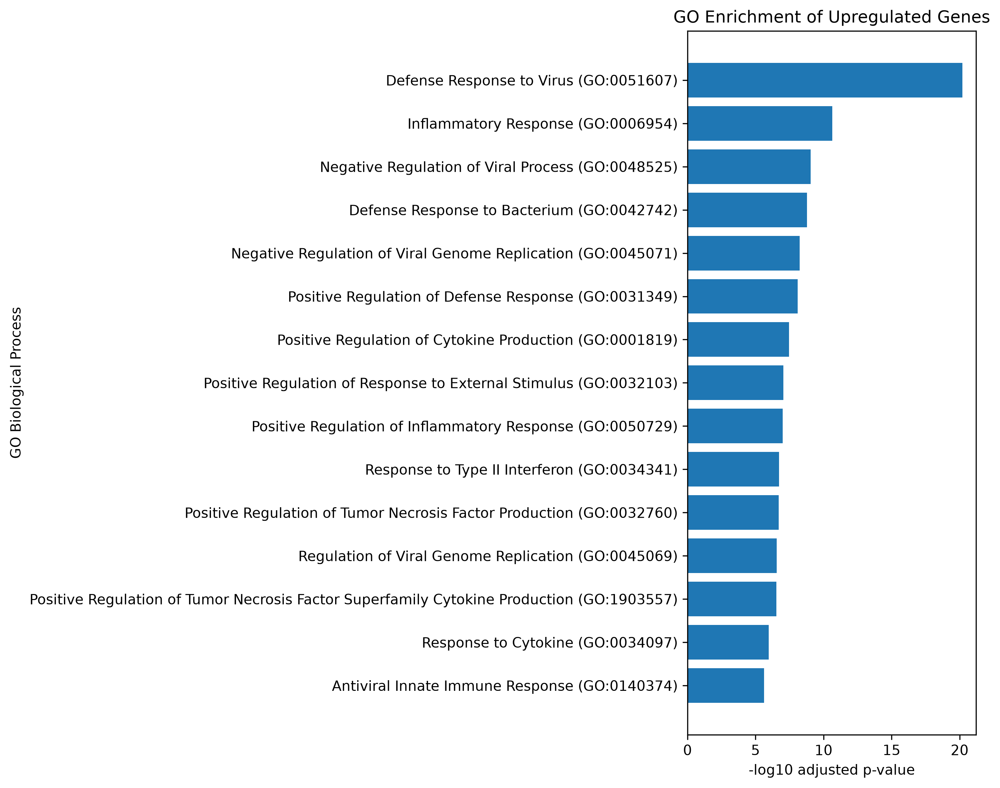
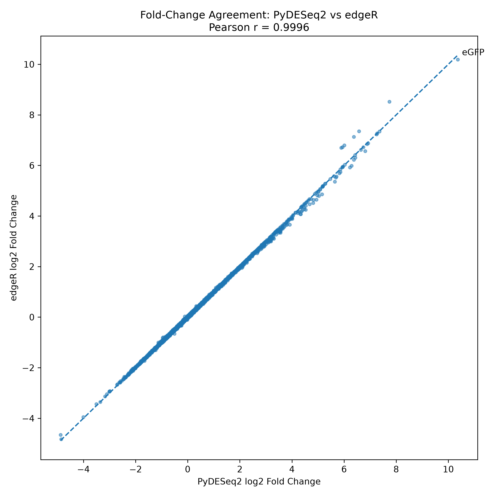
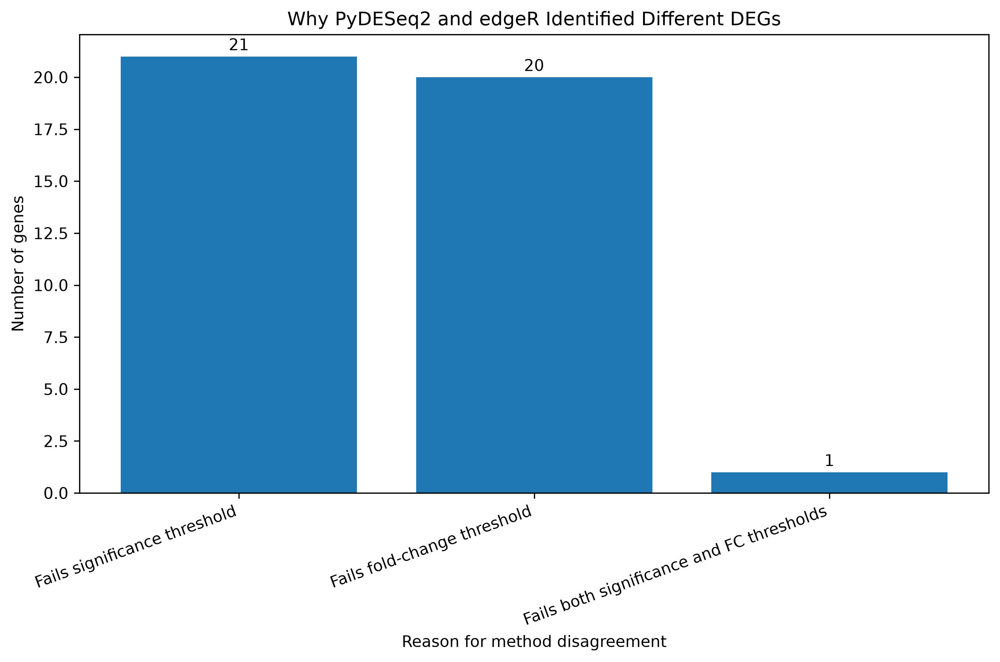

# Comparative RNA-seq Analysis of mRNA-LNP Response Using PyDESeq2 and edgeR

## Overview

I started this project because I wanted to practice RNA-seq analysis on a dataset that is related to mRNA research, instead of only using a general disease dataset.

The dataset contains bulk RNA-seq data from mouse liver samples after systemic administration of eGFP mRNA formulated in lipid nanoparticles (mRNA-LNP), together with saline controls.

My main goal was not only to identify differentially expressed genes, but also to compare two commonly used differential expression workflows:

-PyDESeq2
-edgeR

I wanted to see whether both methods would give similar biological conclusions when they were applied to the same count matrix and experimental design.

This project also became a way for me to practice building a reproducible analysis workflow using both Python and R.

## Research Questions

This project focuses on two main questions:

1. What transcriptomic changes are observed in mouse liver after mRNA-eGFP-LNP administration compared with saline control?
2. How consistent are PyDESeq2 and edgeR in identifying differentially expressed genes from the same RNA-seq dataset?

## Dataset

**GEO accession:** `GSE331154`

The dataset contains gene-level raw read counts generated from mouse liver RNA-seq samples.

| Group | Number of samples |
|---|---:|
| Saline control | 5 |
| mRNA-eGFP-LNP | 5 |
| Total | 10 |

Sample names:

```text
Control:
saline1
saline2
saline3
saline4
saline5

Treatment:
mRNA-eGFP1
mRNA-eGFP2
mRNA-eGFP3
mRNA-eGFP4
mRNA-eGFP5
```

The original featureCounts table contained **57,127 genes/features** across **10 RNA-seq samples**.

For downstream analysis, genes were retained if they had at least **10 reads in at least 3 samples**.

After filtering, **14,432 genes remained**.

## Analysis Workflow

```text
Raw featureCounts matrix
        ↓
Data validation
        ↓
Low-count gene filtering
        ↓
Quality control
        ↓
PCA
        ↓
eGFP sanity check
        ↓
PyDESeq2 differential expression
        ↓
Gene annotation
        ↓
Volcano plot
        ↓
Selected-gene heatmap
        ↓
GO Biological Process enrichment
        ↓
edgeR differential expression
        ↓
PyDESeq2 vs edgeR comparison
        ↓
Analysis of method-specific DEGs
```

The full workflow can also be run automatically using:

```bash
python run_pipeline.py
```

## Quality Control

### PCA

PCA was performed using log-transformed CPM values for exploratory analysis. PC1 explained approximately **67.1%** of the total variance.

The five saline samples and five mRNA-LNP samples were clearly separated along PC1.



This suggested that the largest source of transcriptomic variation in the dataset was strongly associated with the experimental condition.

## eGFP Sanity Check

Because the treatment contains eGFP mRNA, I also checked the raw eGFP read counts before differential expression analysis.

```text
saline1        5
saline2        0
saline3        0
saline4        0
saline5        0

mRNA-eGFP1  1789
mRNA-eGFP2  2295
mRNA-eGFP3  1915
mRNA-eGFP4  1379
mRNA-eGFP5   928
```

The average raw eGFP count was approximately **1.0 in control** and **1661.2 in the mRNA-LNP group**.

This was used as a simple internal sanity check that the treatment samples contained the expected eGFP transcript.

## PyDESeq2 Differential Expression

Differential expression analysis was performed using PyDESeq2 with the contrast **mRNA-LNP vs saline control**.

Significant genes were defined using:

- adjusted p-value < 0.05
- |log2FoldChange| >= 1

| Result | Number of genes |
|---|---:|
| Genes tested | 14,432 |
| Significant DEGs | 1,458 |
| Upregulated | 931 |
| Downregulated | 527 |

The eGFP transcript showed a very strong positive fold change with **log2FoldChange ≈ 10.36**.

### Volcano Plot



## Biological Interpretation

After gene annotation, several strongly upregulated genes were related to interferon signaling, antiviral response, inflammation, and cytokine signaling.

Examples included:

```text
Isg15
Ifi44
Ifit3b
Ifi27l2b
Tgtp1
Cxcl9
Ccl7
Saa3
Ly6a
Cdkn1a
```

Rather than interpreting only individual genes, I selected a small panel of immune-response genes and compared their expression pattern across all samples.

### Selected Immune-Response Genes



The selected genes generally showed lower expression in saline samples and higher expression in the mRNA-LNP group.

This pattern suggested a coordinated immune-related transcriptional response rather than changes in only a few individual genes.

## GO Biological Process Enrichment

GO enrichment was performed separately for upregulated and downregulated genes.

The background gene set was defined using the genes that were actually tested in the differential expression analysis.

Among the upregulated genes, several strongly enriched biological processes were related to antiviral and inflammatory responses, including:

- Defense Response to Virus
- Inflammatory Response
- Negative Regulation of Viral Process
- Negative Regulation of Viral Genome Replication
- Positive Regulation of Cytokine Production
- Positive Regulation of Inflammatory Response
- Response to Type II Interferon
- Response to Cytokine
- Antiviral Innate Immune Response



No GO Biological Process terms reached adjusted p-value < 0.05 among the downregulated genes under the enrichment settings used in this project.

## edgeR Differential Expression

To evaluate whether the results depended strongly on the statistical method, I repeated the differential expression analysis using edgeR.

The same 10 samples, 14,432 genes, experimental groups, fold-change threshold, and FDR threshold were used.

| Result | Number of genes |
|---|---:|
| Genes tested | 14,432 |
| Significant DEGs | 1,454 |
| Upregulated | 929 |
| Downregulated | 525 |

The eGFP fold change estimated by edgeR was **logFC ≈ 10.19**, which was very close to the PyDESeq2 estimate.

## PyDESeq2 vs edgeR

The two methods showed very high agreement.

| Metric | Result |
|---|---:|
| PyDESeq2 DEGs | 1,458 |
| edgeR DEGs | 1,454 |
| Shared DEGs | 1,435 |
| PyDESeq2-only DEGs | 23 |
| edgeR-only DEGs | 19 |
| Jaccard similarity | 0.9716 |
| PyDESeq2 DEGs also detected by edgeR | 98.42% |
| edgeR DEGs also detected by PyDESeq2 | 98.69% |
| Pearson correlation of log2FC | 0.9996 |
| Spearman correlation | 0.9998 |
| Direction agreement among shared DEGs | 100% |

### Fold-Change Agreement



The fold-change estimates from PyDESeq2 and edgeR were almost perfectly correlated.

## Why Were Some DEGs Different?

Although the two methods agreed on most DEGs, there were **23 PyDESeq2-only genes** and **19 edgeR-only genes**.

I checked why these 42 genes were classified differently. The disagreement was mainly caused by genes located close to the predefined thresholds:

- 21 genes failed the significance threshold in the other method
- 20 genes failed the fold-change threshold in the other method
- 1 gene failed both thresholds



This suggests that most method-specific DEGs were not caused by major disagreement in the estimated biological effect, but by small differences around the statistical or fold-change cutoffs.

## Main Findings

1. mRNA-eGFP-LNP and saline samples showed clear transcriptomic separation in PCA.
2. eGFP RNA was strongly detected in the mRNA-LNP samples but almost absent from saline controls.
3. PyDESeq2 identified 1,458 significant DEGs.
4. Upregulated genes showed strong enrichment for antiviral, inflammatory, cytokine-related, and interferon-associated biological processes.
5. PyDESeq2 and edgeR produced highly consistent differential expression results.
6. Most differences between the two methods occurred near the predefined statistical thresholds.

## Important Limitations

One important limitation of this analysis is the experimental control. The comparison is **mRNA-eGFP-LNP vs saline**, with no empty-LNP control.

Therefore, the observed transcriptional response cannot be attributed specifically to the mRNA cargo. The response may reflect the mRNA, the lipid nanoparticle formulation, or their combined effect.

A stronger experimental design for separating these effects could include:

```text
Saline
Empty LNP
Naked mRNA
mRNA-LNP
```

Another limitation is that this is bulk RNA-seq from liver tissue. Changes in gene expression may therefore reflect both transcriptional changes within cells and changes in the relative abundance or activation state of different cell populations.

## Repository Structure

```text
mrna-lnp-rnaseq/
│
├── analysis/
│   ├── 01_preprocessing/
│   │   └── prepare_counts.py
│   ├── 02_quality_control/
│   │   └── qc_analysis.py
│   ├── 03_pydeseq2/
│   │   ├── run_pydeseq2.py
│   │   └── volcano_plot.py
│   ├── 04_biological_analysis/
│   │   ├── annotate_genes.py
│   │   ├── go_enrichment.py
│   │   └── heatmap_selected_genes.py
│   ├── 05_edger/
│   │   └── run_edger.R
│   └── 06_method_comparison/
│       ├── analyze_discordant_genes.py
│       ├── compare_deg_sets.py
│       └── logfc_scatter.py
│
├── data/
│   ├── raw/
│   └── processed/
│
├── results/
│   ├── figures/
│   └── tables/
│
├── run_pipeline.py
├── requirements.txt
├── software_versions.txt
├── .gitignore
└── README.md
```

## Reproducibility

### 1. Clone the repository

```bash
git clone https://github.com/KaydenKing710/mrna-lnp-rnaseq.git
cd mrna-lnp-rnaseq
```

### 2. Create a Python environment

```bash
python -m venv .venv
```

Activate the environment and install the required packages:

```bash
pip install -r requirements.txt
```

### 3. Install R and edgeR

The edgeR analysis requires R and the Bioconductor package `edgeR`.

### 4. Download the raw count matrix

Download the gene-level count matrix from **GEO accession GSE331154** and place it in:

```text
data/raw/
```

with the filename:

```text
GSE331154_mmuegfp_liver_counts.txt
```

### 5. Run the complete pipeline

```bash
python run_pipeline.py
```

The pipeline automatically runs preprocessing, QC, PCA, PyDESeq2, gene annotation, volcano plotting, heatmap generation, GO enrichment, edgeR, and method comparison.

Outputs are written to:

```text
results/figures/
results/tables/
```

## Why I Built the Pipeline This Way

During this project, I was also interested in making the analysis easier to reproduce.

Instead of running every script manually, I created `run_pipeline.py` so that the main workflow can be executed from one entry point.

This was also useful for me to practice automating biological data analysis rather than treating each analysis step as a separate manual task.

## Future Directions

There are several ways I would like to extend this project.

First, I would like to investigate the relationship between transcript abundance and translation instead of looking only at RNA abundance. This is one reason I am interested in learning ribosome profiling (Ribo-seq) and translational regulation.

Other possible extensions include:

- pathway-level comparison between PyDESeq2 and edgeR
- analysis using additional mRNA-LNP datasets
- inclusion of empty-LNP controls when appropriate public datasets are available
- integration of transcriptomic and translational data
- further automation of the analysis and reporting workflow

## Tools Used

```text
Python
PyDESeq2
pandas
NumPy
scikit-learn
matplotlib
GSEApy
MyGene.info

R
edgeR
limma
```

## Reference Data

RNA-seq dataset: **NCBI Gene Expression Omnibus, GSE331154**.

This repository is an independent reanalysis of publicly available data for learning and research portfolio purposes.
